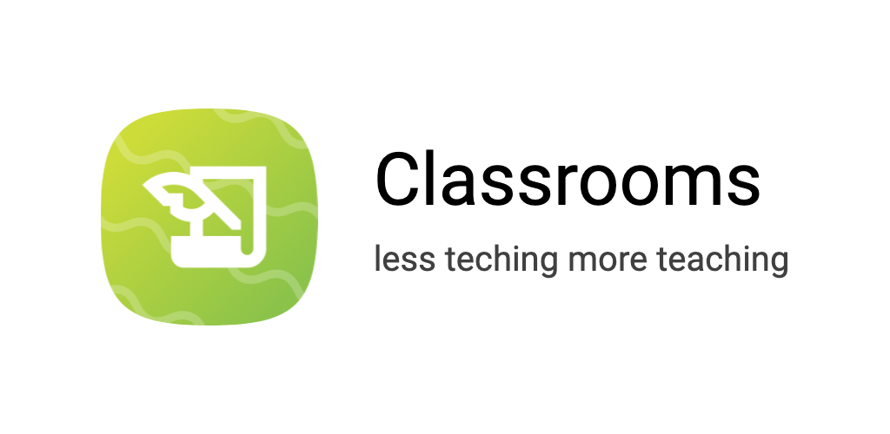
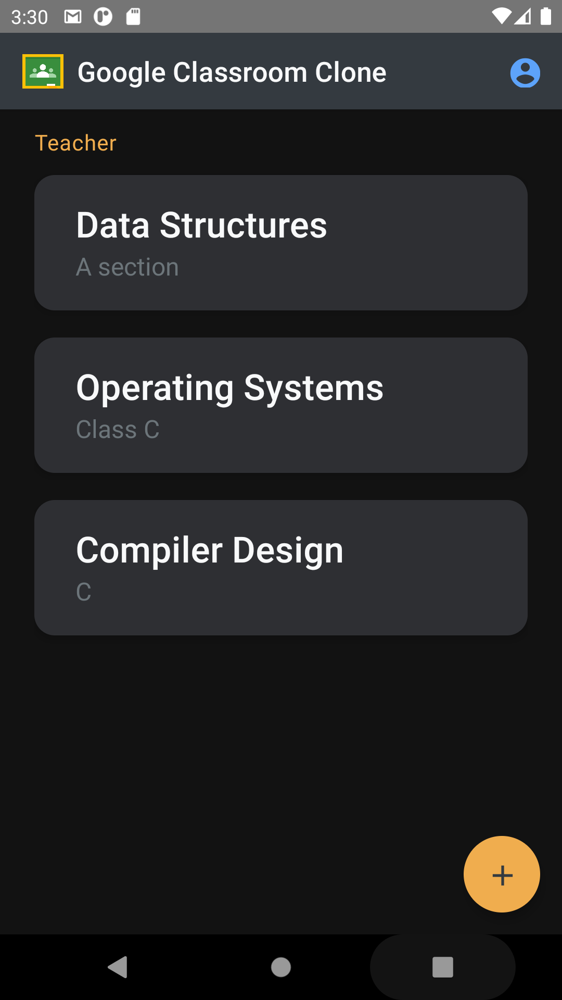
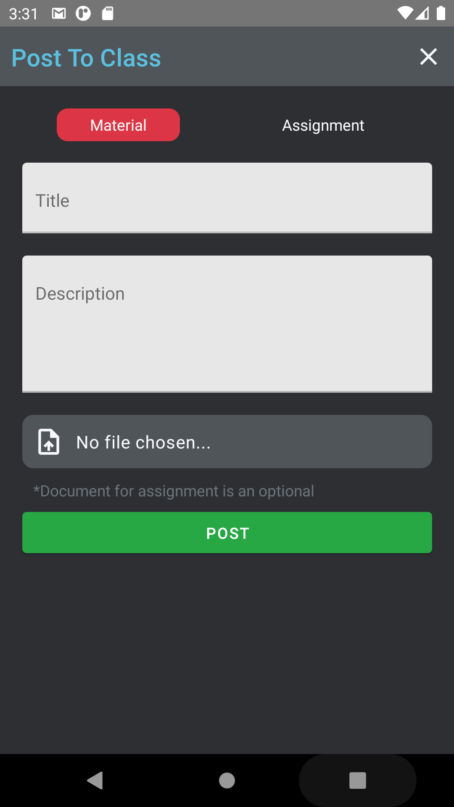
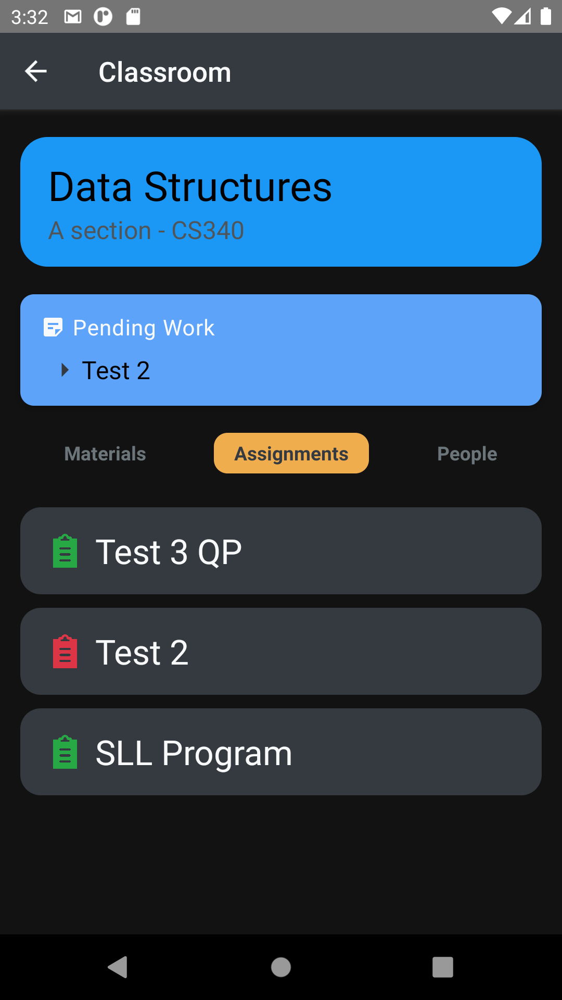
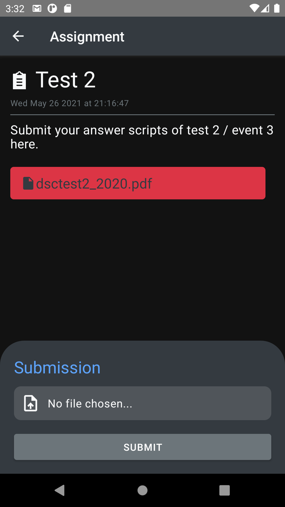

# Classrooms

Free and open-source Google Classroom alternative.
Codebase split in web, native and asset directories. Web directory is a react app.
Deployed as a official Kabeer's Network Education service,

DEMO: https://education.kabeers.network/class/

### Here are  a little screenshots, for the app
Some of them are from the original project

    
    
    
    
    

### And screenshots for the web version
Some of them are from the original project

    
    
    
    
    

<small>(c) 2023 Kabeer's Network</small> - kabeer.network