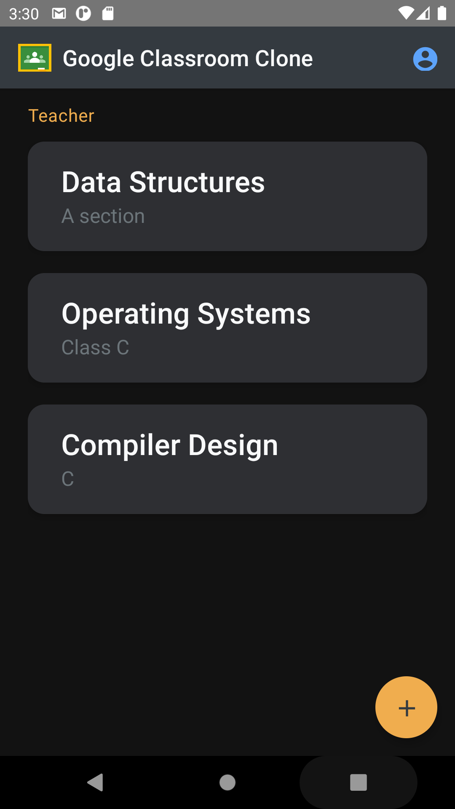
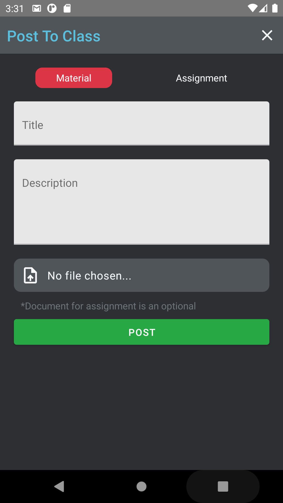
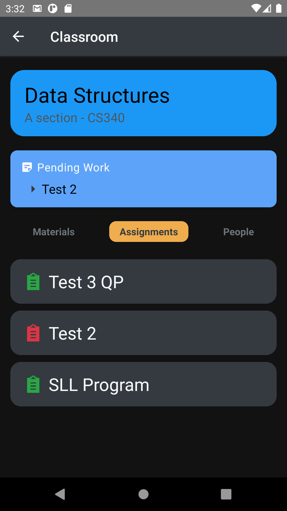
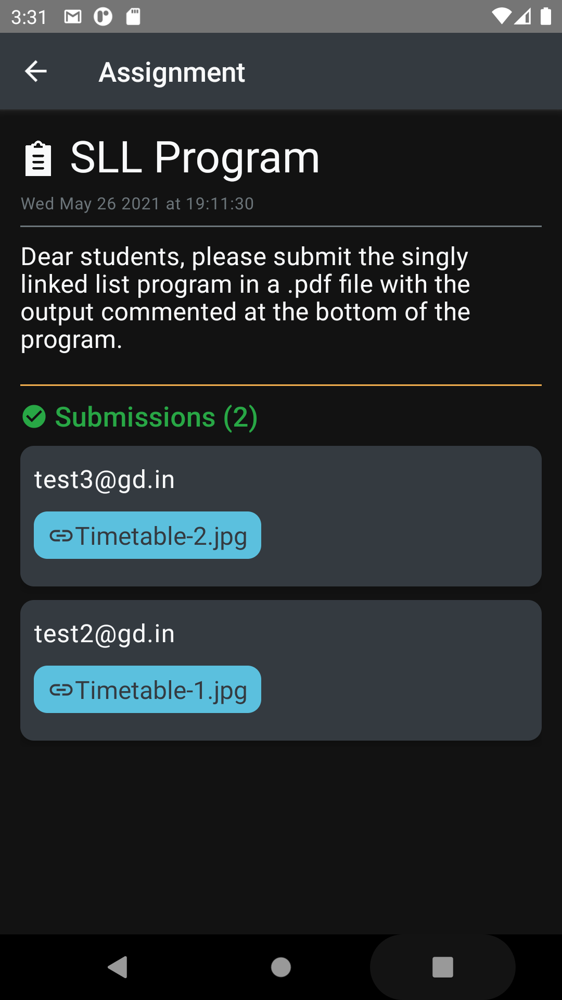
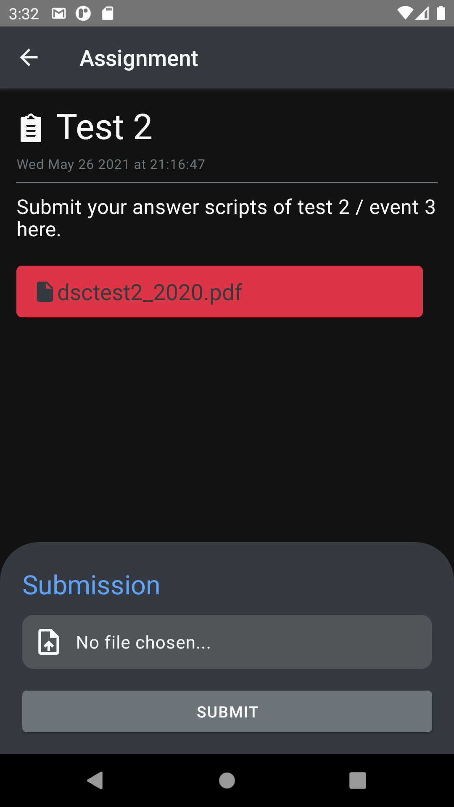

# Google Classroom Clone

### Technologies

`React Native` `Firebase`

[Similar Web App](https://github.com/A7abhilash/google-classroom-clone)

### Screenshots

<h6>
#1 Home | #2 Post to class(For teachers) | #3 Class assignments | #4 Assignment Details(For teachers) | #5 Assignment Details(For students)
</h6>

